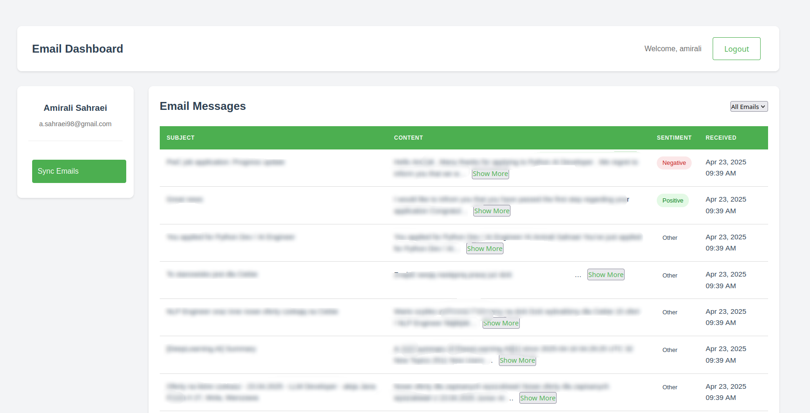

# Gmail Categorization App Powered by LLMs

A Django-based web application that fetches, analyzes, and intelligently categorizes Gmail messages using **Large Language Models (LLMs)** for deeper contextual sentiment understanding. This AI-driven app offers a modern interface to explore and filter your inbox based on nuanced sentiment categories.

---

## 🔍 Key Highlights

- **LLM-Enhanced Email Categorization**
  - Uses transformer-based models for context-aware sentiment analysis
  - Goes beyond basic keyword analysis to detect subtle sentiment and intent
  - Custom or fine-tuned LLM models supported (e.g., DistilBERT, RoBERTa, Groq)

- **Seamless Django Integration**
  - Modular architecture for LLM inference pipelines
  - Django views and services designed to interface with local or cloud-hosted LLMs
  - Built-in support for extending with other NLP tasks (e.g., spam detection, topic extraction)

- **User-Friendly Gmail Dashboard**
  - Gmail OAuth2 login
  - Smart email sync with real-time status
  - Interactive dashboard with sentiment filters and insights

---

## ✨ Features

- **Authentication & Security**
  - Django-powered secure login/signup
  - Per-user Gmail authorization via OAuth2
  - Encrypted token storage

- **Intelligent Email Processing**
  - Gmail API integration
  - LLM-based sentiment and emotion classification
  - Categorization: Positive, Negative, Other
  - Scalable pipeline design with pagination (20 emails/page)
  - Filter & explore by sentiment

- **Modern UI/UX**
  - Responsive, minimalist dashboard
  - Collapsible email previews
  - Visual sentiment indicators
  - Error handling and feedback alerts

---



---

## 🧠 Technologies

- **Backend**
  - Python 3.8+
  - Django 5.2+
  - Gmail API
  - Google OAuth2
  - SQLite / PostgreSQL

- **AI Layer**
  - HuggingFace Transformers
  - PyTorch or TensorFlow (backend agnostic)
  - Pretrained and fine-tuned LLMs for sentiment analysis
  - [Groq LLM API](https://groq.com/)

- **Frontend**
  - HTML5/CSS3
  - JavaScript (vanilla or minimal frameworks)

- **Testing**
  - pytest & pytest-django

---

## 🚀 Getting Started

### 1. Clone the Repository
```bash
git clone git@github.com:amiralisahraei/django-llm-mail.git
cd gmail_categorization
```

### 2. Set Up Your Virtual Environment
```bash
python -m venv venv
source venv/bin/activate  # For Linux/Mac
```

### 3. Install Dependencies
```bash
pip install -r requirements.txt
```

### 4. Configure Environment Variables

```bash
cp .env.example .env
# Edit .env with your Gmail API credentials and Django secret key
```

⚠️ **Important for Local Development:**  
If you're running the app locally (without HTTPS), you must allow OAuth2 to work over insecure HTTP by setting the following environment variable **before** starting the server:

 ```bash
 export OAUTHLIB_INSECURE_TRANSPORT=1
 ```

 This should **only** be used in development environments. **Never** use it in production.

### 5. Apply Migrations
```bash
python manage.py migrate
```

### 6. Launch the App
```bash
python manage.py runserver
```

---

## 🔧 Google API Setup

- Create a project in the [Google Cloud Console](https://console.cloud.google.com)
- Enable Gmail API  
- Set up OAuth consent screen  
- Create OAuth 2.0 credentials  
- Download and save `client_secrets.json` in the project root  

---

## 📂 Project Structure

```
gmail_categorization/
├── gmail_categorization_app/
│   ├── processing/
│   │   ├── load.py                   # Token & Gmail sync utils
│   │   └── sentiment_analysis.py     # LLM integration
│   ├── categorization/
│   │   ├── app.py                    # Main categorization logic
│   │   └── gmail/
│   │       ├── authenticate_gmail.py # Gmail OAuth and API
│   │       └── extract.py            # Email extraction logic
│   ├── templates/
│   ├── static/
│   ├── models.py
│   ├── views.py
│   └── urls.py
├── tests/
│   ├── test_models.py
│   └── test_views.py
├── manage.py
└── README.md
```

---

## ⚙️ Configuration

### `settings.py` Snippet
```python
INSTALLED_APPS = [
    ...
    'gmail_categorization_app',
]

LOGIN_REDIRECT_URL = '/profile/'  
LOGOUT_REDIRECT_URL = '/login/' 
```

### Required Environment Variables
```
GROQ_API_KEY=your-api-key
MODEL_NAME=deepseek-r1-distill-llama-70b
```

---

## 🧪 Testing

Run all tests with:

```bash
pytest
```

Or run a specific test file:

```bash
pytest tests/test_views.py
```

---

## 🧪 Usage

- Register a user account  
- Authorize Gmail access  
- LLM will analyze synced emails  
- View categorized emails by sentiment  
- Filter by category and browse pages  

---

## 📜 License

Licensed under the MIT License. See `LICENSE` file.

---

## 🙏 Acknowledgements

- [Django](https://www.djangoproject.com/)
- [Google Gmail API](https://developers.google.com/gmail/api)
- [Groq](https://groq.com/)
- [HuggingFace Transformers](https://huggingface.co/transformers/)